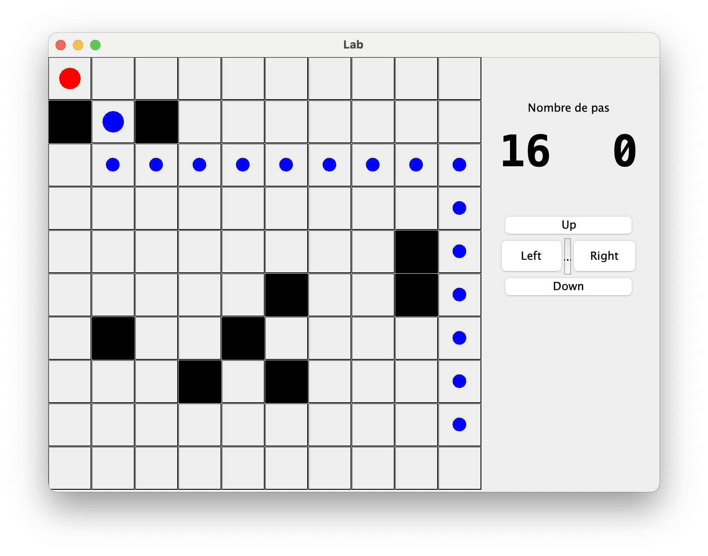

# Overview
## Screen


## Tree
```
src
├── display
│   ├── Case.java
│   ├── Controller.java
│   ├── Field.java
│   ├── GameInformation.java
│   ├── Marker.java
│   ├── MyWindow.java
│   ├── Perso.java
│   └── Score.java
├── listener
│   ├── ControllerListener.java
│   ├── FieldMouseListener.java
│   ├── KeyboardControllerListener.java
│   └── MouseMoveListener.java
└── resource
    ├── Game.java
    ├── Main.java
    └── Player.java

4 directories, 15 files

```